# Combined Nutrition Database Visual Schema

Last updated: 2026-04-12

## Purpose

This page provides a high-level visual schema of the Combined Nutrition Database workflow as it is being migrated into OSE-DA-NT.

It combines:
- the legacy four-layer workflow described in historical manuals
- the current repository structure in OSE-DA-NT
- the boundary between nutrition-pipeline work and DW-Production responsibilities

## Visual Schema

```mermaid
flowchart LR
  subgraph S1[Upstream Inputs]
    A1[Survey microdata]
    A2[Administrative data]
    A3[Modeled external series]
    A4[Legacy source catalogues and survey directories]
  end

  subgraph S2[Reference Layer]
    B1[Indicator directory]
    B2[Disaggregation reference]
    B3[Country and code crosswalks]
    B4[Decision and metadata tables]
  end

  subgraph S3[Legacy Processing System]
    C1[Data source review and inclusion]
    C2[Microdata recode and reanalysis]
    C3[Domain-specific database construction]
  end

  subgraph S4[Legacy Post-Processing System]
    D1[Warehouse import preparation]
    D2[Decision engine integration]
    D3[CMRS-ready structured outputs]
  end

  subgraph S5[CMRS Layer]
    E1[CMRS series and non-series files]
    E2[Accepted versus non-accepted decisions]
    E3[Public versus non-public handling]
    E4[Indicator, country, year, and disaggregation navigation]
  end

  subgraph S6[OSE-DA-NT Current Repository]
    subgraph S6A[reference_data_manager]
      F1[directory_indicator.csv]
      F2[reference_disaggregations.csv]
    end

    subgraph S6B[analysis_datasets]
      G1[Layer-2 standardization]
      G2[CMRS2 parquet and dataset builds]
      G3[Verification and QA checks]
    end

    subgraph S6C[further_transformation_system]
      H1[Projection input prep]
      H2[Indicator-specific progress scripts]
      H3[Final appended progress outputs]
    end

    subgraph S6D[00_documentation]
      I1[Runbooks]
      I2[Migration docs]
      I3[AI instructions and skills]
    end
  end

  subgraph S7[Downstream Consumers]
    J1[Nutrition analytical outputs]
    J2[Progress and target outputs]
    J3[Downstream reporting inputs]
  end

  subgraph S8[External Repository Boundary]
    K1[DW-Production regional aggregation]
    K2[Public data warehouse production]
  end

  A1 --> C1
  A2 --> C1
  A3 --> C3
  A4 --> C1

  B1 --> C3
  B2 --> C3
  B3 --> D1
  B4 --> D2

  C1 --> C2 --> C3 --> D1 --> D2 --> D3
  D3 --> E1
  E2 --> E1
  E3 --> E1
  E4 --> E1

  B1 --> F1
  B2 --> F2
  E1 --> G1 --> G2 --> G3
  F1 --> G1
  F2 --> G1

  E1 --> H1
  F1 --> H1
  F2 --> H1
  G2 --> H1
  H1 --> H2 --> H3

  G2 --> J1
  H3 --> J2
  J1 --> J3
  J2 --> J3

  J3 --> K1 --> K2
```

## How To Read This Schema

1. Upstream inputs and reference assets feed the historical nutrition processing and post-processing workflow.
2. That workflow produces CMRS-structured outputs, which remain the central handoff layer.
3. In OSE-DA-NT, the current migration focus is on reference management, analysis dataset construction, and further transformation.
4. DW-Production remains downstream for regional aggregation and public warehouse production.

## Interpretation Notes

- The left side reflects the historical operating model documented in legacy manuals.
- The middle shows where OSE-DA-NT currently sits during migration.
- The right side marks the explicit boundary where DW-Production takes over.
- This is a system schema, not a file-by-file execution DAG.

## Next Diagram Candidates

- A more detailed post-processing migration schema.
- A file-level schema for analysis_datasets/02_codes/.
- An indicator-family schema for further_transformation_system/projections_progress_class/.